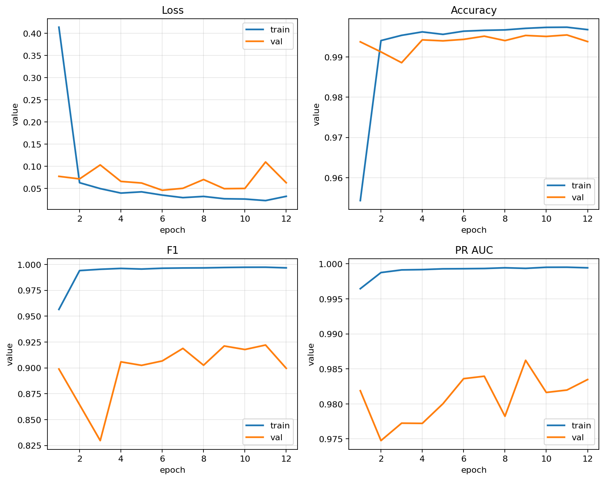
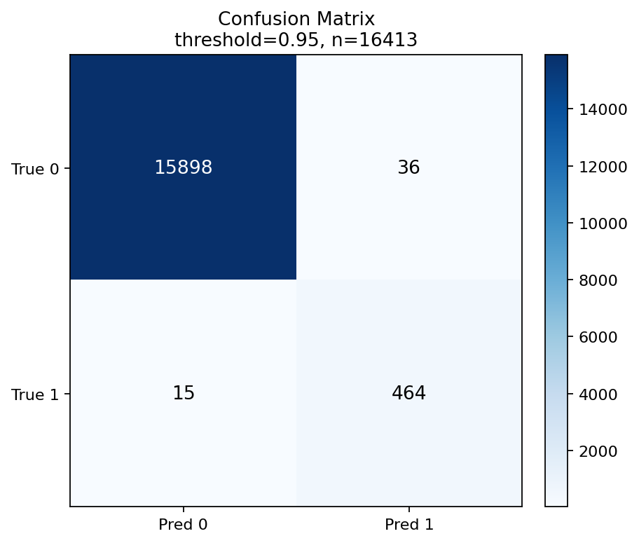
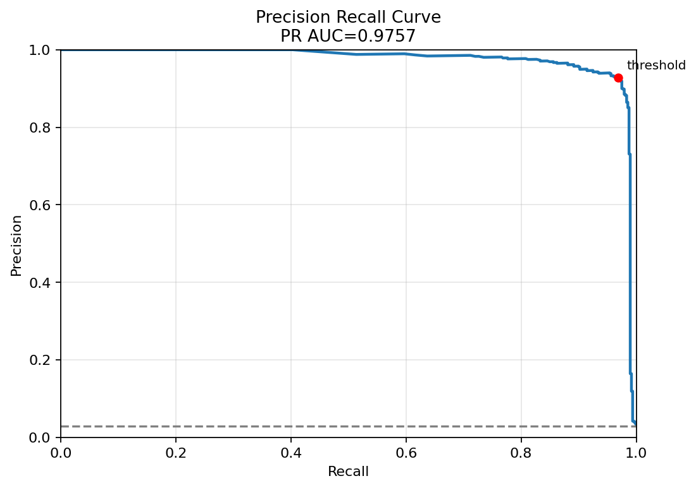
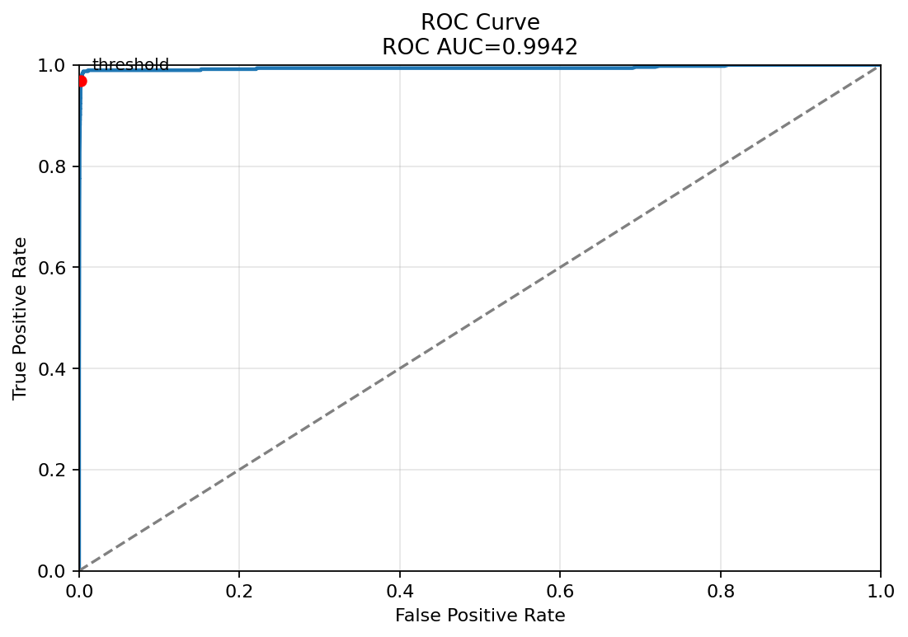

# DL-Swisstopo

Toolkit zum Laden, Labeln, Trainieren und Testen eines Modells für Fussgängerstreifen auf Swisstopo-Tiles.

## Überblick

Der aktuelle Workflow ist:

1. Punkte erzeugen oder vorbereiten
2. Tiles nach `data/unlabeled/` herunterladen
3. Bilder im Web-UI labeln
4. Gelabelte Bilder werden automatisch nach `data/y` oder `data/n` verschoben
5. Modell mit `train.py` trainieren
6. Modell mit `predict.py` auf neue Bilder anwenden

## Projektstruktur

Die wichtigsten Ordner / Files:

```text
├── analyze_errors.py       Fehleranalyse für False Positives und False Negatives
├── app.py                  Startpunkt zum lokalen Starten der Web-Anwendung
├── artifact_utils.py       Hilfsfunktionen zum Finden und Verwalten von Modellartefakten
├── download_tiles.py       Lädt Swisstopo-Tiles herunter und erzeugt die Label-Queue
├── export_error_tiles.py   Exportiert Fehlklassifikationen zur manuellen Sichtung
├── generate_model_plots.py Erzeugt Trainings-, PR-, ROC- und Confusion-Matrix-Plots
├── generate_points_grid.py Erzeugt Punkt- oder Rasterkoordinaten für neue Tile-Abfragen
├── predict.py              Führt Inferenz auf Einzelbildern oder ganzen Ordnern aus
├── requirements.txt        Python-Abhängigkeiten für das Projekt
├── train.py                Trainiert das Klassifikationsmodell
├── artifacts/              Modelle, Metriken, Analysen und Vorhersage-Artefakte
│   ├── analysis/           Auswertungen und Fehleranalysen zu Modellläufen
│   ├── predictions/        Gespeicherte CSV-Vorhersagen aus `predict.py`
│   └── runs/               Vollständige Trainingsläufe mit Checkpoints und Metriken
│       ├── local/          Lokale Trainingsläufe, z. B. auf Mac oder Laptop
│       └── server/         Trainingsläufe vom Server oder GPU-System
├── data/                   Aktive Datenablage für Bilder und Labels
│   ├── labels.csv          Metadaten für offene Bilder in `data/unlabeled`
│   ├── n/                  Negative Bilder: kein Fussgängerstreifen vorhanden
│   ├── unlabeled/          Noch nicht gelabelte Bilder für das Web-UI
│   └── y/                  Positive Bilder: Fussgängerstreifen vorhanden
├── plots/                  Exportierte Vergleichsplots zu trainierten Modellläufen
├── slurm/                  Shell- und SLURM-Skripte für Server-Trainingsläufe
└── webapp/                 Flask-Webapp mit Backend, Templates, CSS und JavaScript
```

## Bedeutungen der Labels

- `1` / positiv: Fussgängerstreifen vorhanden
- `0` / negativ: kein Fussgängerstreifen vorhanden

## Voraussetzungen

Mindestens benötigt:

- Python 3
- `requests`, `flask`, `pillow`, `torch`
- `torchvision` (optional)

Installation:

```bash
python3 -m venv .venv
source .venv/bin/activate
python3 -m pip install -r requirements.txt
```

## Quickstart

### 1. Punkte erzeugen

Anhand Koordinaten

```bash
python3 generate_points_grid.py \
  --xmin 2722500 \
  --ymin 1207000 \
  --xmax 2725500 \
  --ymax 1209500 \
  --step 25 \
  --sampling blocks \
  --num-blocks 64 \
  --block-size 4 \
  --region-id region_custom_01 \
  --output points.csv
```

Hinweis:

- Koordinaten sind in `EPSG:2056`
- `points.csv` braucht mindestens `x`, `y`, `region_id`

(Alternativ kann auch der swissimage_annotator verwendet werden)

### 2. Tiles herunterladen

```bash
python3 download_tiles.py
```

Das Skript:

- lädt Bilder nach `data/unlabeled/<region_id>/`
- speichert sie als Koordinaten-Dateinamen wie `2725075_1208825.jpg`
- schreibt Metadaten nach `data/labels.csv`

### 3. Bilder im Web-UI labeln

Webserver starten:

```bash
python3 app.py
```

Dann im Browser die angezeigte lokale URL öffnen.
Der Labeling-Tab zeigt nur offene Bilder aus `data/unlabeled`.

Beim Speichern gilt:

- `1` -> Datei wird nach `data/y` verschoben
- `0` -> Datei wird nach `data/n` verschoben

Danach verschwindet das Bild aus der offenen Queue.

### 4. Modell trainieren

Einfacher Testlauf auf dem Mac:

```bash
python3 train.py \
  --device cpu \
  --model simple_cnn \
  --pretrained off \
  --epochs 2 \
  --batch-size 32 \
  --lr 1e-4
```

Empfohlener grösserer Lauf:

```bash
python3 train.py \
  --balanced-sampling \
  --model auto \
  --pretrained auto \
  --device auto \
  --epochs 12 \
  --batch-size 64 \
  --spatial-bin-size 1000 \
  --output-dir artifacts/runs/local/manual-efficientnet-run
```

Was `train.py` macht:

- trainiert direkt aus `data/y` und `data/n`
- liest Koordinaten aus Dateinamen wie `x_y.png`
- erzeugt einen räumlichen Split für `train`, `val`, `test`
- speichert das beste Modell standardmässig in einen neuen Ordner unter `artifacts/runs/local/`

Wichtige Optionen:

- `--device auto|cpu|mps|cuda`
- `--model auto|simple_cnn|resnet18|efficientnet_b0`
- `--pretrained auto|on|off`
- `--balanced-sampling`
- `--csv-path data/labels.csv`

Outputs:

- `<output-dir>/best_model.pt`
- `<output-dir>/metrics.json`
- `<output-dir>/manifest.csv`

Hinweis:

- Trainingsläfe liegen in `artifacts/runs/`
- Details zur Ablage stehen in `artifacts/README.md`

## Inferenz

Einzelbild:

```bash
python3 predict.py \
  --checkpoint artifacts/runs/server/completed/a100_baseline_effb0/best_model.pt \
  --input data/y/2599350_1200900.png
```

Ganzer Ordner:

```bash
python3 predict.py \
  --checkpoint artifacts/runs/server/completed/a100_baseline_effb0/best_model.pt \
  --input data/y \
  --output-csv artifacts/predictions/predictions.csv
```

Die Ausgabe enthält:

- `score`: Modellwahrscheinlichkeit für Fussgängerstreifen
- `prediction`: `1` oder `0`
- `threshold`: verwendete Entscheidungsschwelle

## Formate

### `points.csv`

```csv
x,y,label,region_id,block_id
2725075.0,1208825.0,,region_glarus_01,block_0001
2725100.0,1208825.0,crosswalk,region_glarus_01,block_0001
```

Hinweise:

- `label` ist optional
- `block_id` ist optional
- gültige Labelwerte für CSV-basiertes Training sind `1`, `0`, `crosswalk`, `no_crosswalk`, `ignore`

### `data/labels.csv`

```csv
image_path,label,region_id,x,y,block_id
data/unlabeled/region_glarus_01/2725075_1208825.jpg,,region_glarus_01,2725075,1208825,block_0001
```

## Web-UI

Die Web-App hat zwei Bereiche:

- `Labeling`: offene Bilder sichten und nach `data/y` oder `data/n` verschieben
- `Modell-Test`: einzelne Bilder hochladen und mit dem gespeicherten Modell prüfen

## Aktuelle Modellstände

Stand im Repo: `2026-05-16`. Die stärksten vorhandenen Server-Läufe nutzen alle `efficientnet_b0` mit vortrainierten Gewichten. Die Testmenge ist in diesen Läufen identisch: `n=16413`, davon `479` positiv und `15934` negativ.

| Lauf | Strategie | Accuracy | Precision | Recall | F1 | PR-AUC | Threshold |
| --- | --- | ---: | ---: | ---: | ---: | ---: | ---: |
| `a100_balanced_sampling` | `both` | `0.9969` | `0.9280` | `0.9687` | `0.9479` | `0.9759` | `0.95` |
| `sampler_only_effb0` | `sampler` | `0.9968` | `0.9383` | `0.9520` | `0.9451` | `0.9720` | `0.90` |
| `a100_baseline_effb0` | `pos_weight` | `0.9966` | `0.9343` | `0.9499` | `0.9420` | `0.9808` | `0.95` |
| `final_sampler_only_effb0_img320` | `sampler`, `img_size=320` | `0.9961` | `0.9462` | `0.9186` | `0.9322` | `0.9745` | `0.90` |

Kurz gelesen:

- `a100_balanced_sampling` hat im Repo aktuell den besten `F1`-Wert.
- `a100_baseline_effb0` hat die beste `PR-AUC`.
- `final_sampler_only_effb0_img320` hat die höchste `Precision`, verliert aber bei `Recall` und `F1`.

Plots des aktuell stärksten Laufs `a100_balanced_sampling`:

<p>
  
  
</p>
<p>
  
  
</p>

## Zusammenarbeit
Für dieses Modul wurde mit anderen Student*innen zusammengearbeitet.
Fabian, Silvan, Neel, Frederic und ich haben uns zusammengetan und Bilder untereinander ausgetauscht.
Jeder hat einen Bereich (Stadt) der Schweiz klassifiziert.
